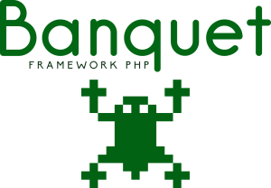

<p align="center">
  
</p>

<h1 align="center">Banquet</h1>

<p align="center">
  <strong>Banquet è un mini Framework Development Tool PHP per lo sviluppo rapido di applicazioni Web e API REST, basato su generazione automatica del codice a partire dal database.</strong>
  <br>
  MVC · Front Controller · DI Container · Composite View · Routing avanzato · Generatore automatico di classi
  <br><br>
  


  
</p>

---

## 🚀 Cos'è Banquet

Banquet è un micro-framework + code generator che permette di creare rapidamente:

- Entity
- DAO
- Model
- Service
- API REST
- View (opzionale)
- Routing automatico

Tutto partendo direttamente dalle tabelle del database.

---

## ⚡ Obiettivo

Ridurre drasticamente il tempo di sviluppo:

👉 da database → a API funzionante in pochi secondi.

---

## ✨ Features

- 🧠 Generazione automatica da database
- 📦 CRUD completo out-of-the-box
- 🔌 API REST auto-create
- 🔁 Routing automatico
- 🧱 Architettura MVC
- ⚙️ Dependency Injection Container
- 🔐 Sicurezza integrata:
  - CSRF protection
  - password hashing
  - session management
- 📜 Supporto metodi HTTP:
  - GET, POST, PUT, DELETE, PATCH, OPTIONS, HEAD
- 🧾 DAO con:
  - getAll()
  - getById()
  - insert / update / delete

---

## 🧩 Generazione automatica

A partire da una tabella database:

```sql
corsi (id, nome, descrizione)
```
```shell
cmd: php generator/generate.php --table=corsi --with-api
```

---


## Perché Banquet?

| | |
|---|---|
| **Leggero** | Nessuna dipendenza esterna. Solo PHP puro e Composer per l'autoload PSR-4. |
| **Veloce** | Front controller minimale, DI Container con auto-resolution via Reflection. Nessun overhead inutile. |
| **Completo** | MVC, Routing, Middleware, CRUD, API JSON, i18n, Template Composite, Logger, Mail, CSRF. |
| **Produttivo** | Generatore automatico che da una tabella DB produce Entity, DAO, Model, Service, Action, View, Route e REST Api in pochi secondi. |
| **Flessibile** | Supporta MySQL, PostgreSQL, SQLite e SQL Server con un unico driver PDO. |

---

👉 [Guida rapida](https://github.com/mssalvo/banquet/blob/main/docs/guida-rapida.md)
👉 [Documentazione](https://github.com/mssalvo/banquet/blob/main/docs/documentazione.md)

---

## Inizio Rapido

```bash
# 1. Avvia il server built-in PHP
php -S localhost:8000

# 2. Genera l'intero stack CRUD per la tabella "corsi"
php generator/generate.php --table=corsi --action=Corsi --with-view --with-route --with-api

# 3. Visita
#    http://localhost:8000/corsi      ← Lista corsi (HTML)
#    http://localhost:8000/api/corsi   ← Lista corsi (JSON)
```

**9 file generati con un solo comando.** Nessuna scrittura manuale.

---

## Punti di Forza

### 1. Generatore Automatico di Classi

Dimentica la scrittura boilerplate. Banquet legge lo schema del database e genera tutto:

```bash
# Dal database
php generator/generate.php                                # Tutte le tabelle
php generator/generate.php --table=clienti                # Una tabella specifica

# Dal Service (Action + View + Route + API)
php generator/generate.php --action=Clienti --with-view --with-route --with-api
```

  Entity → DAO → Model → Service → Action (Web) → Action (REST) → View → Route → Route API

### 2. Routing Espressivo

Pattern matching avanzato con parametri, regex e middleware fluente:

```php
$router->get('/articoli/{slug}', \Banquet\Actions\Articolo::class);
$router->get('/articoli/{id:\d+}', \Banquet\Actions\Articolo::class);
$router->get('/blog/{slug}-{id}', \Banquet\Actions\Articolo::class);
$router->post('/articoli', \Banquet\Actions\Articolo::class)->middleware('auth');
```

### 3. DI Container con Auto-Resolution

Nessuna configurazione. Il container risolve le dipendenze automaticamente:

```php
class Articoli extends SenderAction {
    public function __construct(
        ArticoliService $service,    // Risolto automaticamente
        Logger $log                  // Anche questo
    ) {
        // Pronto all'uso
    }
}
```

### 4. API JSON in una riga

Trasforma qualsiasi Action in un endpoint REST:

```php
class ArticoliRest extends SenderAction {
    public function send() {
        $this->setTemplateName("pages/json");
        $data = $this->route('id')
            ? $this->service->getArticoloById($this->route('id'))
            : $this->service->getAllArticoli();
        $this->varAdd("json", json_encode($data));
        $this->getResponse()->addHeader('Content-Type: application/json');
        return $this->getTemplate('empty');
    }
}
```

### 5. Template Composite

Componi le pagine come blocchi (Header, Menu, Carousel, Footer...):

```php
public function send() {
    $this->setTemplateName("pages/home");
    $this->setTemplateChildren([
        \Banquet\Actions\Header\Header::class,
        \Banquet\Actions\Menu\Menu::class,
        \Banquet\Actions\Footer\Footer::class
    ]);
    return $this->getTemplate("default");
}
```

Nel master:

```html
<body>
    <?= $Header ?? '' ?>
    <?= $Menu ?? '' ?>
    <main><?= $default ?? '' ?></main>
    <?= $Footer ?? '' ?>
</body>
```

### 6. Multi-Database

Un unico driver PDO per tutti i database:

| Driver | Configurazione |
|--------|---------------|
| MySQL | `DB_DRIVER=mysql` |
| PostgreSQL | `DB_DRIVER=pgsql` |
| SQLite | `DB_DRIVER=sqlite` |
| SQL Server | `DB_DRIVER=sqlsrv` |

### 7. Middleware

Proteggi le route con middleware dichiarativo:

```php
$router->get('/admin', \Banquet\Actions\Admin\Dashboard::class)->middleware('auth');
$router->get('/login', \Banquet\Actions\Login::class)->middleware('guest');
```

---

## Esempi

### CRUD completo per "Clienti"

```bash
# 1. Crea la tabella MySQL
CREATE TABLE clienti (
    id INT AUTO_INCREMENT PRIMARY KEY,
    nome VARCHAR(100),
    email VARCHAR(100),
    telefono VARCHAR(20)
);

# 2. Genera tutto
php generator/generate.php --table=clienti --action=Clienti --with-view --with-route --with-api

# 3. Fatto. Hai già:
#    GET  /clienti          → lista (HTML)
#    GET  /api/clienti      → lista (JSON)
#    GET  /api/clienti/5    → cliente #5 (JSON)
```

### Endpoint REST custom

```php
use Banquet\Actions\Api\ClientiRest;

class ClientiRest extends SenderAction {
    private $service;

    public function __construct(ClientiService $service) {
        $this->service = $service;
    }

    public function send() {
        $this->setTemplateName("pages/json");

        $method = $_SERVER['REQUEST_METHOD'];

        switch ($method) {
            case 'GET':
                $data = $this->route('id')
                    ? $this->service->getClientiById($this->route('id'))
                    : $this->service->getAllClienti();
                break;
            case 'POST':
                $body = json_decode(file_get_contents('php://input'), true);
                $entity = new Clienti($body);
                $this->service->salva($entity);
                $data = ['success' => true, 'id' => $this->service->getLastId()];
                break;
            default:
                $data = ['error' => 'Method not allowed'];
        }

        $this->varAdd("json", json_encode($data));
        $this->getResponse()->addHeader('Content-Type: application/json');
        return $this->getTemplate('empty');
    }
}
```

---

## Struttura del Progetto

```
banquet/
├── index.php                 # Front controller
├── generator/
│   └── generate.php          # Generatore automatico di classi
├── app/
│   ├── src/
│   │   ├── Core/             # Nucleo del framework
│   │   ├── Actions/          # Controller
│   │   ├── Model/            # Model layer
│   │   ├── Dao/              # Data Access Object
│   │   ├── Service/          # Business logic
│   │   ├── Entity/           # Entity (una per tabella)
│   │   ├── routes/web.php    # Tutte le route
│   │   └── view/             # Template (master, pages, componenti)
│   ├── brand/                # Asset statici
│   └── setting/              # Configurazione
└── vendor/
```

---

## Requisiti

- PHP >= 7.4
- Composer
- PDO extension per il driver scelto (mysql, pgsql, sqlite, sqlsrv)

## Installazione

```bash
composer install
```

Configura il database in `app/src/ms/ms-config.php` e via.

---

<p align="center">
  <sub>Built with ❤️ for PHP developers who value simplicity and productivity.</sub>
</p>
